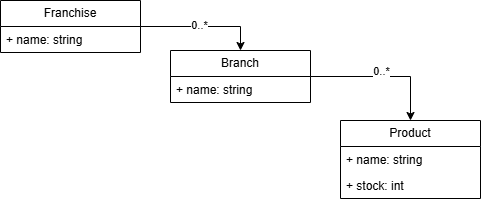
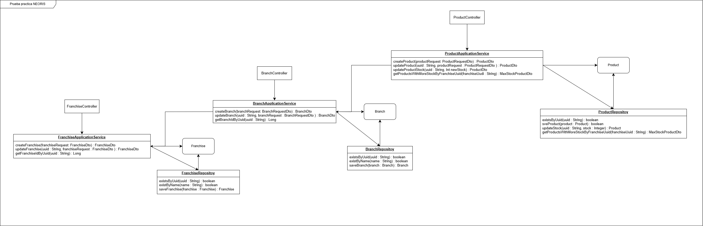

# NEORIS - Prueba Práctica Backend

Prueba práctica sobre el manejo de franquicias y sus sucrusales con productos asociados.

## Tecnologias

- Java
- Spring Boot
- Spring Webflux
- Maven
- Spring data R2DBC
- Project reactor
- Junit
- Mockito
- Jacoco
- Flyway
- MySQL
- AWS
- Docker

## Diagramas
**Entidades:** 
**Clases:** 

## Funcionalidades

- **Agregar una franquicia:**  
  `POST http://localhost:8080/prueba-practica-neoris/api/v1/franchise`
   ```bash
   curl --location 'http://localhost:8080/prueba-practica-neoris/api/v1/franchise' --header 'Content-Type: application/json' --data '{"name": "franchise-test"}'

- **Agregar una sucursal a una franquicia:**  
  `POST http://localhost:8080/prueba-practica-neoris/api/v1/branch`
   ```bash
   curl --location 'http://localhost:8080/prueba-practica-neoris/api/v1/branch' --header 'Content-Type: application/json' --data '{"name": "branch-test", "franchiseUuid": "31901c88-0ea2-11f0-914c-0a675a1bc593"}'

- **Agregar un producto nuevo a una sucursal:**  
  `POST http://localhost:8080/prueba-practica-neoris/api/v1/product`
   ```bash
   curl --location 'http://localhost:8080/prueba-practica-neoris/api/v1/product' --header 'Content-Type: application/json' --data '{"name": "product-test", "branchUuid": "31c3fa24-0ea2-11f0-914c-0a675a1bc593"}'

- **Eliminar un producto de una sucursal:**  
  `DELETE http://localhost:8080/prueba-practica-neoris/api/v1/product/{productUuid}`
   ```bash
   curl --location --request GET 'http://localhost:8080/prueba-practica-neoris/api/v1/product/31901c88-0ea2-11f0-914c-0a675a1bc593'

- **Obtener el producto con más stock por sucursal:**  
  `GET http://localhost:8080/prueba-practica-neoris/api/v1/product/{franchiseUuid}`
   ```bash
   git clone https://github.com/victor013001/prueba-practica-neoris.git

- **Actualizar el nombre de una franquicia:**  
  `PATCH http://localhost:8080/prueba-practica-neoris/api/v1/franchise/{franchiseUuid}`
   ```bash
   curl --location --request PATCH 'http://localhost:8080/prueba-practica-neoris/api/v1/franchise/1701568a-2b4a-4289-a7c0-2aa01b1acfbb' --header 'Content-Type: application/json' --data '{"name": "branch-postman-2"}'

- **Actualizar el nombre de una sucursal:**  
  `PATCH http://localhost:8080/prueba-practica-neoris/api/v1/branch/{branchUuid}`
   ```bash
   curl --location --request PATCH 'http://localhost:8080/prueba-practica-neoris/api/v1/branch/1701568a-2b4a-4289-a7c0-2aa01b1acfbb' --header 'Content-Type: application/json' --data '{"name": "branch-postman-2"}'

- **Actualizar el nombre de un producto:**  
  `PATCH http://localhost:8080/prueba-practica-neoris/api/v1/product/{productUuid}`
   ```bash
   curl --location --request PATCH 'http://localhost:8080/prueba-practica-neoris/api/v1/product' --header 'Content-Type: application/json' --data '{"uuid": "31f4b2a4-0ea2-11f0-914c-0a675a1bc593", "name": "product-test", "stock": 20}'

## AWS
**Acceder a la aplicación:**
  - La aplicación esta disponible en ``.
  - Se puede acceder a los diferentes endpoints descritos en la sección de **Funcionalidades**

## Configuración Local

### Requisitos previos

- Tener una base de datos MySQL en funcionamiento.
- Crear un archivo `.env` en la raíz del proyecto con los siguientes valores:

  ```env
  ENV DB_PASSWORD=${DB_PASSWORD}
  ENV DB_PORT=${DB_PORT}
  ENV DB_SCHEMA=${DB_SCHEMA}
  ENV DB_URL=${DB_URL}
  ENV DB_USERNAME=${DB_USERNAME}

1. **Clonar el repositorio:**

   ```bash
   git clone https://github.com/victor013001/prueba-practica-neoris.git

2. **Construir el proyecto con docker-compose:**

   ```bash
   docker-compose up --build

3. **Acceder a la aplicación:**

    - La aplicación estará disponible en `http://localhost:8080/prueba-practica-neoris/`. 
    - Se puede acceder a los diferentes endpoints descritos en la sección de **Funcionalidades**.
 